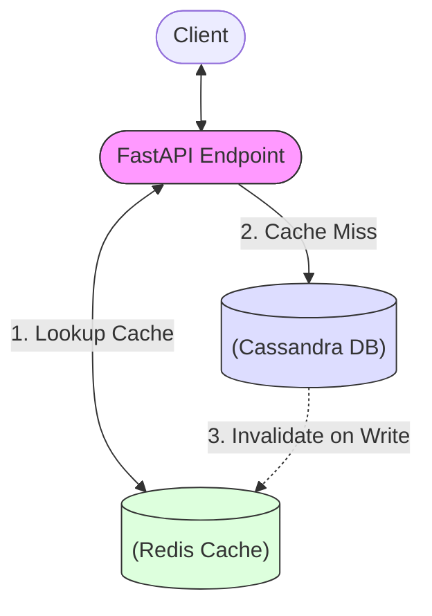

# Feature Progress Update - February 18, 2026

## Summary of Changes

Phase 8 (Performance & Optimization) is now complete. Redis-backed pagination caching, column-level SQL queries, Cassandra batch inserts, and expanded performance benchmarks have been implemented alongside a critical bug fix in the export pipeline.

---

## Key Updates

### **Overall Completion: 80%** (up from 75%)
- Release 1: 100% Complete ✅
- Release 2: 80% Complete (up from 65%)
- Release 3-4: Not started

---

## Release 2 Status Update: 80% Complete

### ✅ **Newly Completed Components**

**Phase 8: Performance & Optimization - COMPLETED 🚀**
- **Redis Pagination Cache**: New `PaginationCacheService` provides cache-first reads for `get_rows()` and `list_datasets()`, with automatic invalidation on insert, update, delete, and masking rule changes.
- **Column-level SQL**: `get_rows()` now generates `SELECT col1, col2, ...` instead of `SELECT *` when a `columns` query parameter is provided, pushing filtering to Cassandra.
- **Batch Inserts**: `insert_rows()` refactored from row-by-row writes to Cassandra `BatchStatement` (UNLOGGED, 50 rows/batch) for significantly improved throughput.
- **Bug Fix**: Fixed `export_dataset()` referencing undefined `all_rows` variable — now correctly uses `rows`.
- **Benchmarks**: Added large-scale insert benchmarks (10K, 100K, 1M rows) and pagination cache throughput tests.
- **Unit Tests**: 19 new tests for `PaginationCacheService` — all passing.

### Previously Completed

**Phase 6: Cloud Storage & Scalability (Weeks 11-12) - COMPLETED ✅**
- Refactored from shared table to per-dataset tables (`ds_rows_<uuid>`).
- Structured typed Cassandra columns instead of JSON blobs.
- Dynamic schema inference from uploaded files.
- New metadata fields: `file_format`, `size_bytes`, `status`.

**Phase 7: Frontend Development (Weeks 13-16) - IN PROGRESS 🏗️**
- Robustness overhaul with null-checks across dataset pages.
- Data visualization crash fixes for zero-row datasets.
- API alignment (`items` vs `rows`) with Redux expectations.

---

## Technical Details

### Phase 8 Architecture

### New & Modified Files

| File | Change |
|------|--------|
| `app/services/pagination_cache.py` | **NEW** — Redis pagination cache service |
| `app/services/dataset_service.py` | Cache integration, column SQL, batch inserts, bug fix |
| `app/main.py` | `columns` query param on rows endpoint |
| `pyproject.toml` | Added `redis ^5.0.0` dependency |
| `tests/unit/test_pagination_cache.py` | **NEW** — 19 unit tests |
| `tests/performance_benchmarks.py` | Bulk insert + cache throughput benchmarks |

### Docker Compatibility
- ✅ **No Docker changes required** — Redis service, env vars (`REDIS_HOST=redis`), and `depends_on` were already configured in `docker-compose.yml`.
- ✅ Dockerfile uses `poetry install` which auto-installs the new `redis` dependency.

---

## What's Next (Phase 9)

### Phase 9: Testing & Documentation
- [ ] Update integration tests to verify dynamic table teardown.
- [ ] Document the "one-table-per-dataset" architecture in system design docs.
- [ ] End-to-end cache invalidation integration tests with Docker Compose.

---

## Metrics Summary

| Metric | Value | Status |
|--------|-------|--------|
| Release 1 Completion | 100% | ✅ Complete |
| Release 2 Completion | 80% | 🚀 Phase 8 Done |
| Storage Architecture | Per-Dataset Tables | ✅ Scalable |
| Storage Format | Structured Columns | ✅ Type-Safe |
| Pagination Caching | Redis-backed | ✅ Implemented |
| Insert Optimization | Batch Statements | ✅ Implemented |
| Frontend Stability | 100% Crash-free | ✅ Verified |
| Pagination Cache Tests | 19/19 passing | ✅ 100% Pass |

---

**Report Generated:** February 18, 2026  
**Next Review:** February 22, 2026  
**Project Status:** ON TRACK ✅
