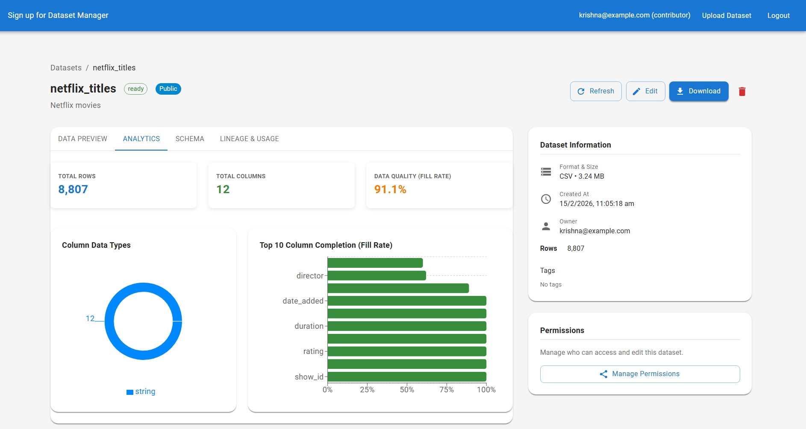
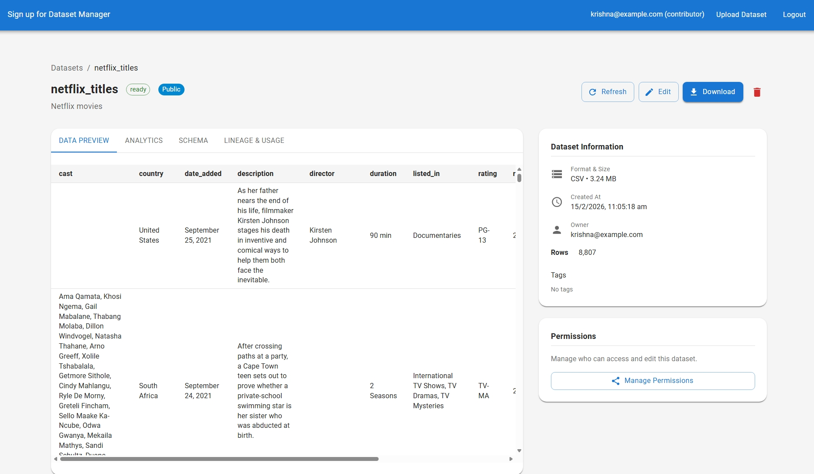
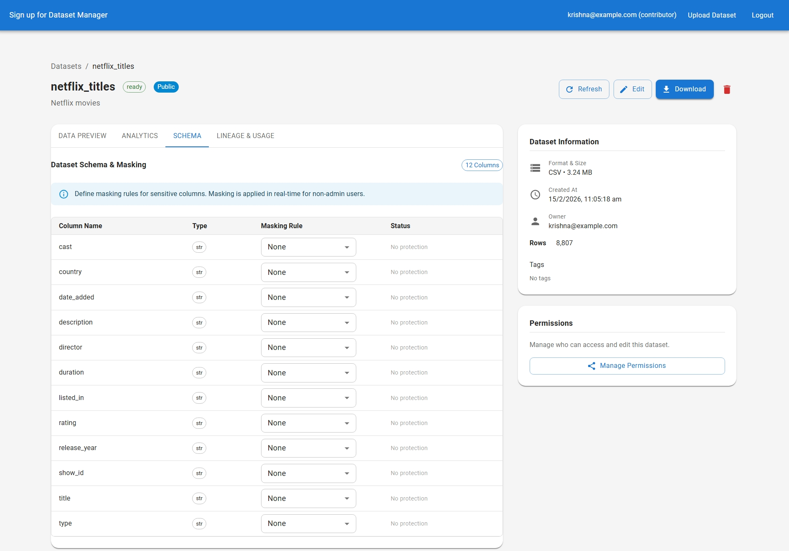

# Dataset Manager Platform

A high-performance, scalable platform designed for managing, analyzing, and securing large-scale datasets. This platform features a hybrid storage architecture, dynamic data masking, and a robust ETL pipeline.


**Note**: This is a work in progress, need to fix unit test failures also and I am using this project to learn about data engineering, data science, and software engineering.
---
## Tools used
- VSCODE + Github Copilot
- Google Antigravity
- Docker
- Docker Compose

---

##  Project Documentation

- **[Enhanced Product Requirements Document (PRD)](./Enhanced-PRD.md)**: Detailed specifications, system architecture, and project roadmap.
- **[Feature Progress Update](./FEATURE_PROGRESS_UPDATE.md)**: Current implementation status, completed milestones, and upcoming tasks.

---

*   **Dynamic Storage Engine**: Automatically creates per-dataset Cassandra tables with typed columns for optimized performance.
*   **Privacy-First Analytics**: Context-aware data masking (Email, SSN, Phone, CC) that automatically adapts based on user roles.
*   **Advanced Visualization**: Real-time data quality metrics and distributions powered by Recharts.
*   **Event-Driven Architecture**: Fully integrated with Apache Kafka for real-time audit logging and system events.
*   **Scalable ETL Pipeline**: Apache Airflow DAGs for automated dataset validation and ingestion.
*   **Multi-Backend Storage**: Support for AWS S3, local MinIO, and flat-file storage via a factory pattern.

---

## 📸 Screenshots

| Dashboard Overview | Dataset Analytics |
|:---:|:---:|
|  |  |

| Data Preview & Masking | Schema Management |
|:---:|:---:|
|  |  |

---

## 🛠️ Technical Stack

### **Backend**
- **Framework**: FastAPI (Python 3.10+)
- **Database**: Apache Cassandra (structured per-dataset tables)
- **Task Queue**: Apache Airflow
- **Messaging**: Apache Kafka
- **Caching**: Redis
- **Auth**: JWT with Bcrypt password hashing
- **Testing**: Pytest

### **Frontend**
- **Framework**: React 18 with TypeScript
- **State Management**: Redux Toolkit
- **UI Library**: Material UI (MUI)
- **Visuals**: Recharts
- **Form Handling**: React Hook Form + Zod
- **Build Tool**: Vite

---

## 📁 Project Structure

```text
datasetmanager/
├── dataset-manager/              # Backend (Python/FastAPI)
│   ├── app/
│   │   ├── core/                 # Security, Masking, Config
│   │   ├── services/             # Dataset, Permission, Pagination Cache
│   │   ├── schemas/              # Pydantic request/response models
│   │   ├── integrations/         # S3, Kafka, Redis, Local Storage
│   │   ├── middleware/           # Audit Logging, Rate Limiting
│   │   ├── monitoring/           # Prometheus Metrics, Grafana Config
│   │   ├── utils/                # Shared helpers
│   │   └── main.py              # FastAPI app & route definitions
│   ├── airflow/dags/             # Airflow ETL pipeline DAGs
│   ├── scripts/                  # DB migration & init scripts
│   ├── tests/
│   │   ├── unit/                 # Unit tests (services, cache)
│   │   ├── integration/          # Integration tests (Release 2)
│   │   └── performance_benchmarks.py
│   ├── pyproject.toml            # Single dependency manifest
│   ├── Dockerfile
│   └── docker-compose.yml
│
├── frontend/                     # Frontend (React/TypeScript)
│   ├── src/
│   │   ├── api/                  # Axios client & endpoint wrappers
│   │   ├── components/           # Reusable UI components
│   │   ├── pages/                # Views (List, Detail, Upload, Analytics)
│   │   ├── store/                # Redux Toolkit slices & hooks
│   │   ├── types/                # TypeScript type definitions
│   │   └── theme/                # MUI theme customization
│   └── Dockerfile
│
├── Planning/                     # Architecture & design docs
├── Enhanced-PRD.md               # Product Requirements Document
├── FEATURE_PROGRESS_UPDATE.md    # Release progress tracker
└── README.md
```

---

## 🐳 Docker Capability

The entire platform is containerized and can be launched with a single command. This includes the application services (Backend & Frontend) and all infrastructure dependencies.

### **Quick Start with Docker**
1.  **Build and Start**:
    ```bash
    docker-compose up --build -d
    ```
2.  **Initialize Database**:
    Wait for Cassandra to be healthy (approx. 60s), then run:
    ```bash
    docker-compose exec fastapi poetry run python scripts/init_cassandra.py
    ```

### **Service Access**
| Service | URL | Note |
|:---|:---|:---|
| **Frontend** | `http://localhost:5173` | Main Web UI |
| **API Backend** | `http://localhost:8000` | API Documentation at `/docs` |
| **MinIO Console**| `http://localhost:9001` | Object Storage Browser |
| **Cassandra** | `localhost:9042` | Primary Database |
| **Redis** | `localhost:6379` | Cache Layer |
| **Kafka** | `localhost:9092` | Event Streaming |

---

## 🚦 Local Development (Manual)

### **Prerequisites**
- Python 3.10+ & Poetry
- Node.js 18+ & npm
- Docker (for infrastructure only)

### **1. Infrastructure Setup**
Start only the dependencies (Cassandra, Kafka, Redis, MinIO):
```bash
docker-compose up -d cassandra kafka redis minio
```

### **2. Backend Setup**
```bash
cd dataset-manager
poetry install
# Initialize Cassandra schema
poetry run python scripts/init_cassandra.py
# Run the application
poetry run uvicorn app.main:app --reload
```

### **3. Frontend Setup**
```bash
cd frontend
npm install
npm run dev
```
The application will be available at `http://localhost:5173`.

---

## 🛡️ Security & Privacy

This platform implements a robust security model:
- **RBAC**: Role-Based Access Control (Admin, Owner, Viewer).
- **Data Masking**: Automatic redacting of sensitive fields for non-admin users.
- **Audit Trails**: Every data access and modification is logged to Kafka for compliance.
- **Rate Limiting**: Integrated middleware to prevent brute-force and API abuse.

---

## ⚖️ License

This project is licensed under the MIT License - see the [LICENSE](LICENSE) file for details.
